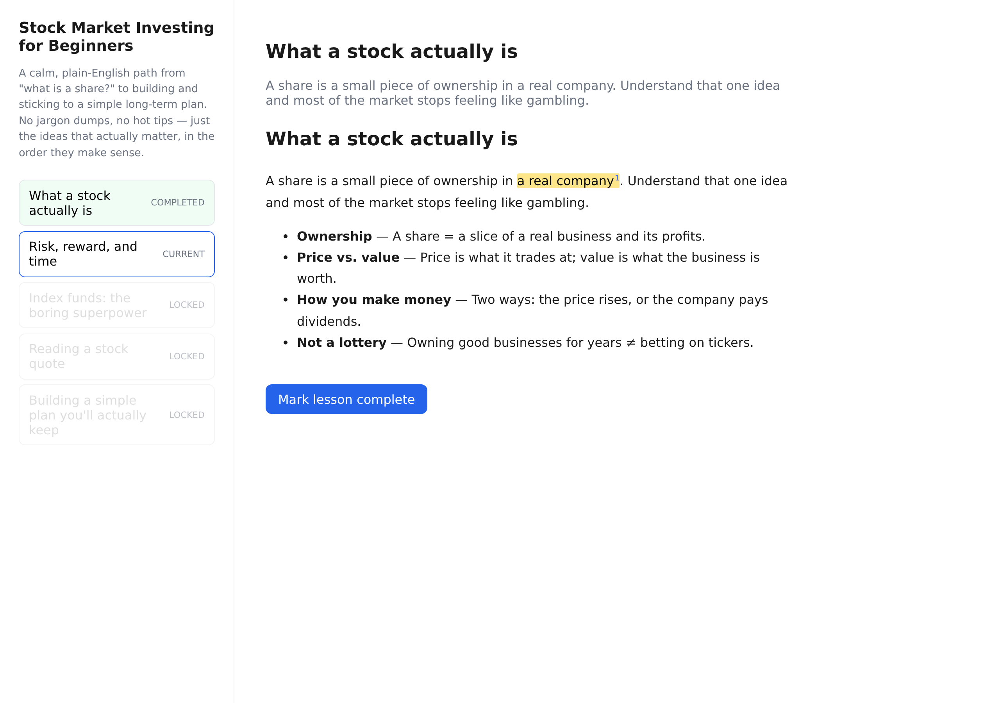
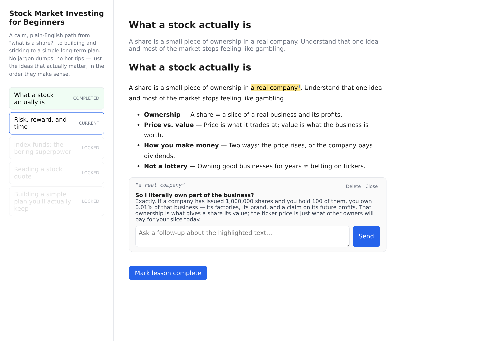
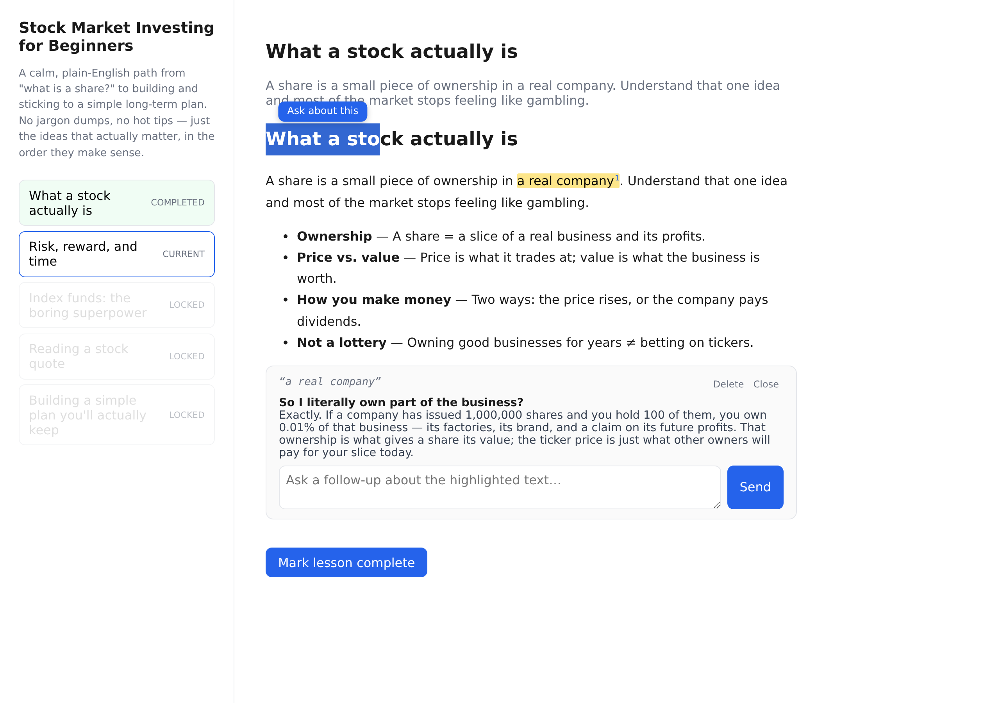

# learn-anything

> Turn **"I want to learn X"** into a real learning app — not a one-off chat, but a
> system you own: a structured course path, an AI tutor that knows where you are, and a
> signature **select-any-text-to-ask-a-follow-up** annotation interaction.

`learn-anything` is an [Agent Skill](https://docs.claude.com/en/docs/agents-and-tools/agent-skills/overview)
that builds a personal AI learning system for **any topic** — cooking, linear algebra,
Rust, the French Revolution. The learner talks about their subject; the skill quietly
builds the engineering behind it: a zero-backend single-page app (React + TypeScript +
Vite, data in the browser) that talks to any OpenAI-compatible LLM, so it runs anywhere
with no setup.

## What it builds

The four pillars, every time:

1. **A structured course path** — the topic becomes an ordered list of lessons that build
   on each other. Progress persists; completing a lesson unlocks the next.
2. **A context-aware AI tutor** — each lesson opens a focused tutor conversation primed
   with which lesson it is, what's been covered, and the learner's level.
3. **Select-to-ask annotation (the signature move)** — highlight any span of any tutor
   answer → a floating "ask about this" button → an inline Q&A thread opens right under
   that text → multi-turn follow-ups, all persisted as your own annotated notebook.
4. **Everything persists** — progress, chats, and annotations live in the browser. Close
   the tab, come back to your annotated course.

## See it in action

These are real screenshots of the bundled **learn-stock** example (a 5-lesson "Stock
Market Investing for Beginners" course built with the skill).

**The course path — lessons with progress and unlock state:**


**A persisted highlight with a footnote badge:**



**The select-to-ask inline Q&A thread — highlight a phrase, ask about just that bit:**



**Live selection → the floating "Ask about this" button:**



## How it works

This skill is an **application of** vibe-engineering to one valuable app shape. The whole
personality of any given course lives in a single file — `src/data/course.ts`. Everything
else is **domain-agnostic, reusable core** that ships with the skill:

- `src/lib/highlight.ts` — pure functions mapping a DOM selection to plain-text offsets and
  splicing highlight markup back into rendered HTML. Unit-tested; this is the fiddly heart
  of the annotation interaction.
- `src/lib/markdown.ts` — a deliberately small Markdown→HTML renderer so offset mapping
  stays predictable.
- `src/stores/{progress,chat,annotation}Store.ts` — Zustand stores (with `persist`) for
  unlock logic, per-lesson tutor threads, and annotation threads.
- `src/components/AnnotatedMessage.tsx` — the React glue: selection handling, the floating
  ask button, the inline thread panel.
- `src/lib/llm.ts` — a thin OpenAI-compatible chat client, configured by env vars.

See [`skills/learn-anything/references/`](skills/learn-anything/references/) for the design
docs: course design, template architecture, the annotation interaction, and LLM config.

## Repository layout

```
.
├── skills/learn-anything/      # the skill itself
│   ├── SKILL.md                # workflow + the four pillars
│   ├── scripts/scaffold.py     # generates the Vite+React+TS app, installs the core
│   ├── assets/templates/       # the domain-agnostic reusable modules
│   ├── references/             # design docs (loaded as needed)
│   └── evals/evals.json        # benchmark test cases
├── examples/learn-stock/       # a real course built with the skill (source only)
├── docs/
│   ├── screenshots/            # the images above
│   └── benchmark.md            # measured skill impact
└── LICENSE
```

## Quick start (using the skill)

The skill is meant to be driven by an agent. In short, it:

```bash
# 1. Scaffold a new app for a topic
python3 skills/learn-anything/scripts/scaffold.py --name my-course --topic "What you're learning"

# 2. Fill src/data/course.ts with the lesson outline, then:
cd my-course
npm install
npm test          # confirm the reusable core is green
npm run build
```

Point it at any OpenAI-compatible endpoint via a `.env` (see `.env.example`): a local
runner like Ollama / LM Studio / vLLM for the minimal track, or a hosted gateway. In a
pure browser app the key ships to the client, so only use a local endpoint or a key you're
comfortable exposing — to keep a key secret, graduate to a backend (see
`references/llm-config.md`).

> **Sandbox note:** if `npm test` hits an `EAGAIN` / worker-spawn limit, re-run
> single-threaded: `npx vitest run --pool=forks --poolOptions.forks.singleFork=true --no-file-parallelism`.

## Does the skill actually help?

Measured across 3 topics (linear algebra, the French Revolution, home cooking), 3 runs
each, with-skill vs. an unaided baseline:

| Metric | With Skill | Without Skill | Delta |
|--------|------------|---------------|-------|
| Pass rate | **100% ± 0%** | 18% ± 17% | **+82pp** |

Without the skill the agent tends to fall back to an ad-hoc script or a static page; with
it, all four pillars (especially the select-to-ask interaction) show up reliably. Full
numbers in [`docs/benchmark.md`](docs/benchmark.md).

## License

[MIT](LICENSE).
